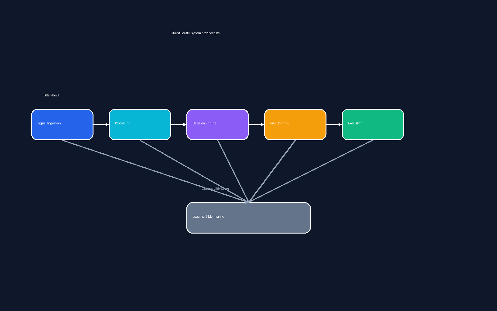

# 🚁 Quant Beast — Modular Decision & Automation System

## 📌 Overview

Quant Beast is a modular Python-based system designed to analyse signals, apply decision logic, and execute actions in a controlled and observable way.

While originally developed in a trading context, the system demonstrates broader capabilities relevant to:

- Cyber security operations
- Automated decision systems
- Signal analysis and filtering
- Risk-aware execution pipelines

---

## 🎯 Purpose

This project was built to explore:

- How to structure a system that ingests noisy data
- How to apply layered decision-making logic
- How to control execution through thresholds and safeguards
- How to monitor, log, and iterate on system behaviour

---

## 🧠 What This Demonstrates

- Systems thinking and architecture design  
- Modular component separation  
- Threshold-based decision logic  
- Risk control mechanisms  
- Logging and observability  
- Iterative development and debugging  
- AI-assisted development with validation  

## 🏗️ Architecture

The diagram below illustrates the system’s modular structure, decision flow, and observability layer:

---

## 🧩 Core Components

### 1. Signal Ingestion
- Collects raw input data
- Normalises and prepares it for analysis

---

### 2. Scoring & Decision Engine
- Applies weighted scoring logic
- Filters signals based on thresholds
- Determines whether an action should be taken

---

### 3. Risk Controls
- Minimum score thresholds
- Probability gating
- Safe execution modes (e.g. simulation vs live)
- Cooldowns and rate limiting

---

### 4. Execution Layer
- Executes decisions when conditions are met
- Supports controlled and staged execution

---

### 5. Logging & Monitoring
- Captures decisions and system state
- Enables debugging and retrospective analysis
- Provides transparency into system behaviour

---

## ⚙️ Key Design Principles

### Controlled Automation
Actions are never taken blindly — all decisions pass through defined gates and thresholds.

### Separation of Concerns
Each module handles a specific responsibility, making the system easier to debug and extend.

### Observability
All major actions and decisions are logged to support traceability and validation.

### Iterative Improvement
The system is designed to evolve through testing, feedback, and refinement.

---

## 🤖 AI Usage & Validation

AI tools were used to:
- assist with code structure and logic design
- accelerate iteration cycles
- generate and test ideas

Validation included:
- verifying outputs against expected behaviour
- ensuring thresholds and logic behaved correctly
- avoiding over-reliance on generated code

> AI was used as a development accelerator, not a replacement for reasoning or control.

---

## 🔄 Relevance to Cyber Security

Although developed in a trading context, the same design patterns apply to:

- Security alert triage systems  
- Detection pipelines  
- Automated response workflows  
- Signal-to-noise filtering  
- Risk-based decision engines  

This project demonstrates how I approach building **controlled, observable, and reliable decision systems**.

---

## ⚡ Key Takeaway

> This is not just a script — it is a structured system designed to process signals, apply logic, manage risk, and execute actions in a controlled way.