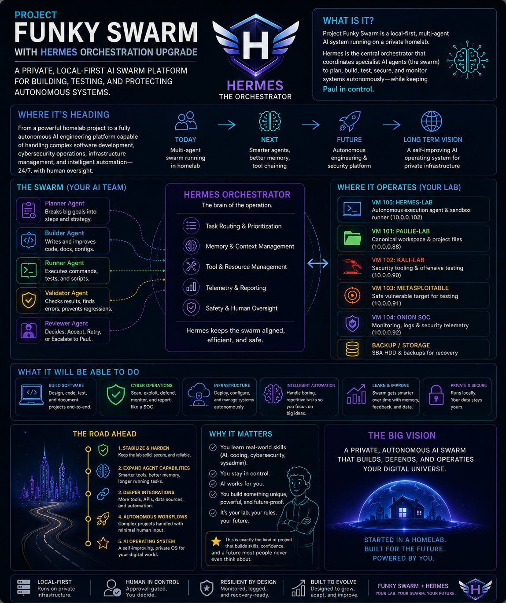
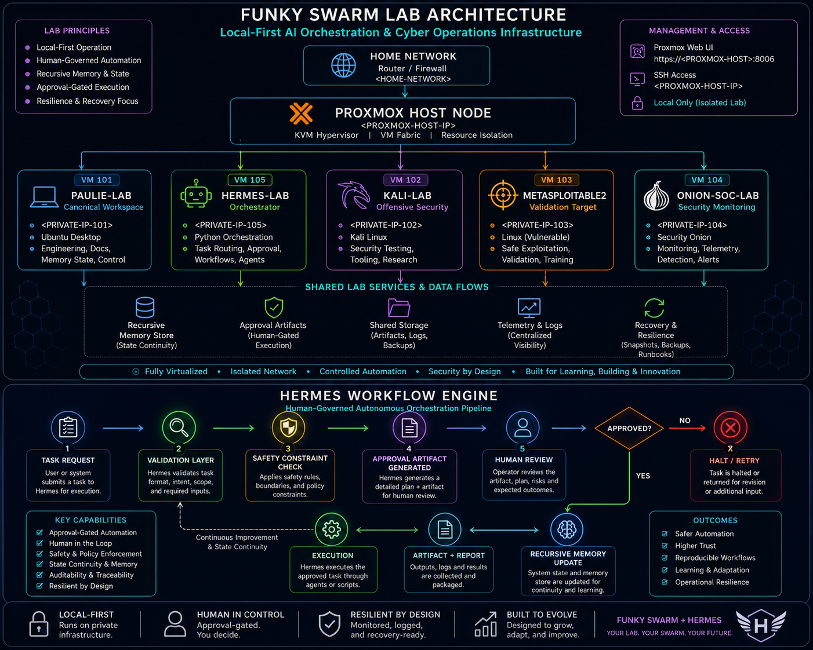
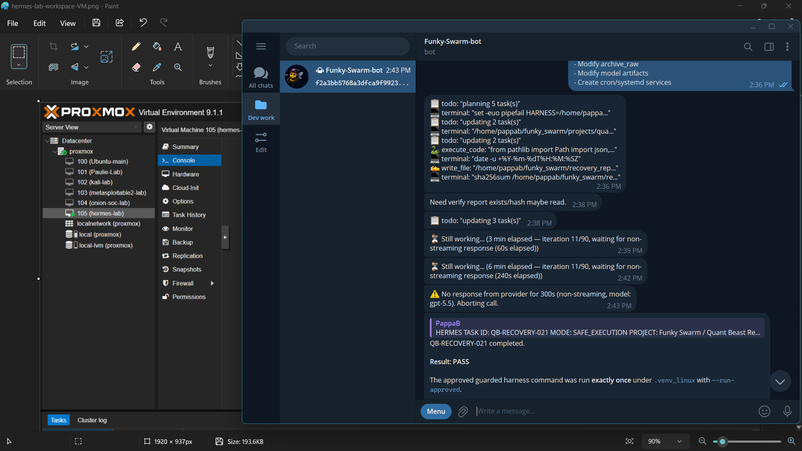
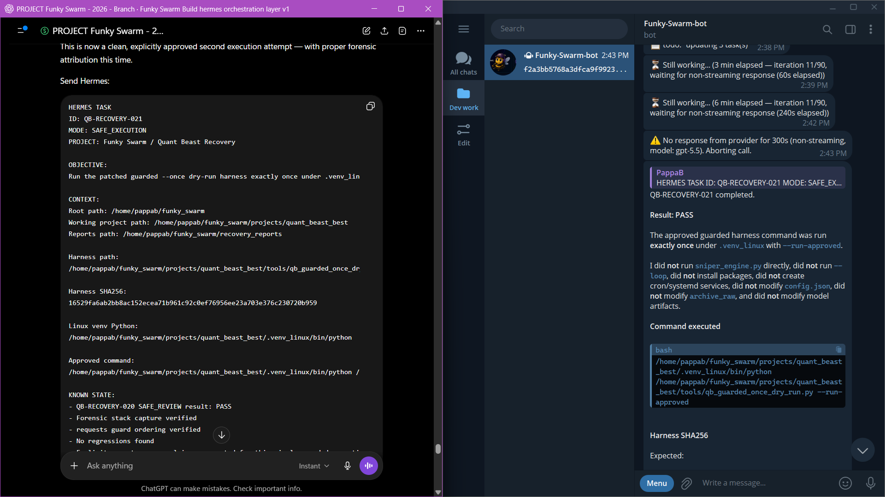
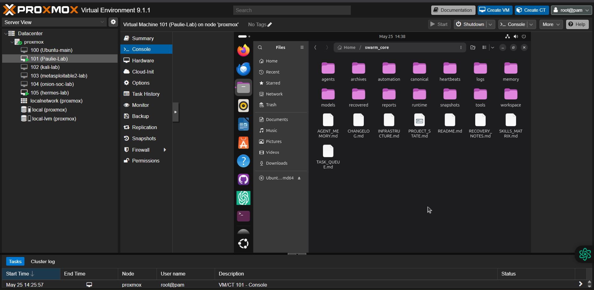
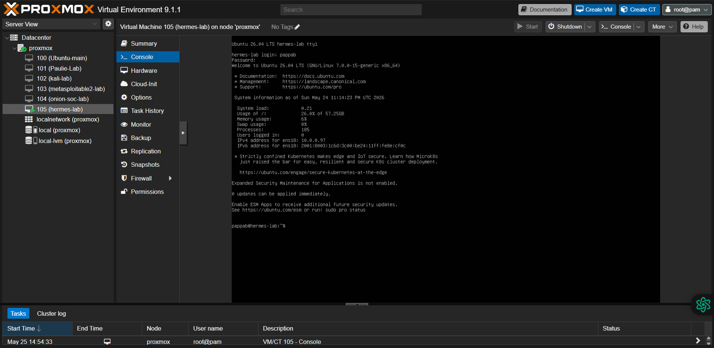
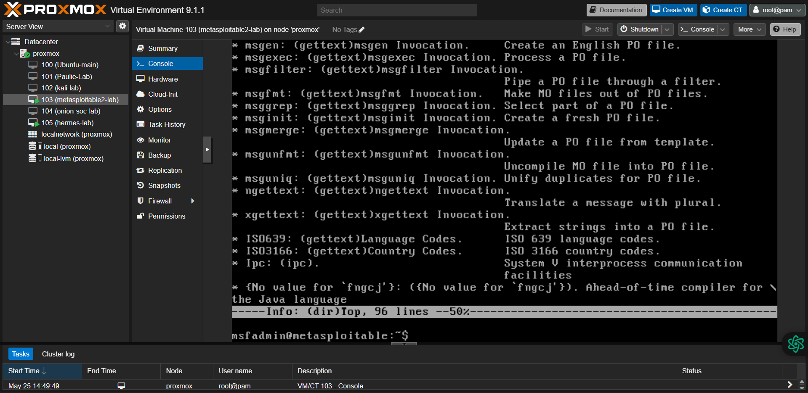
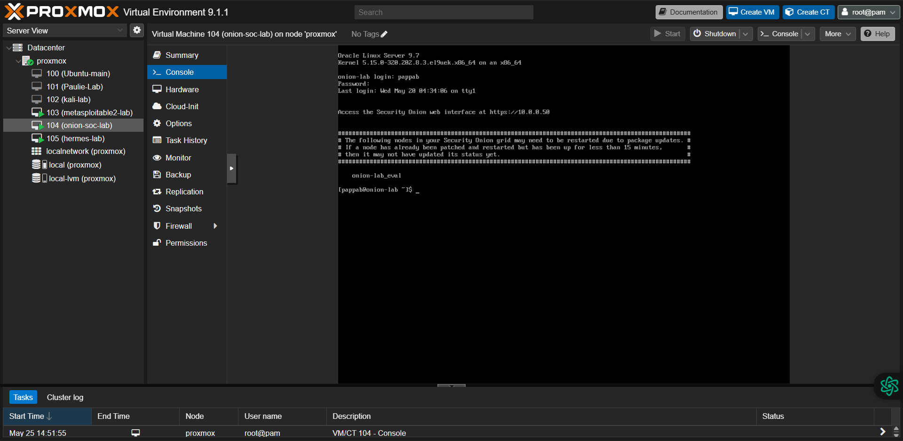
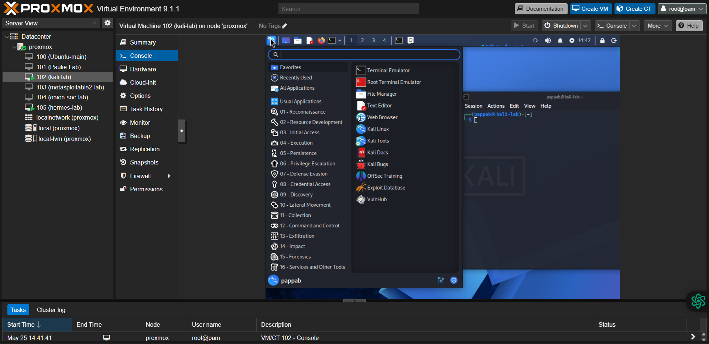

# 🐝 PROJECT FUNKY SWARM  
## ⚡ Distributed AI Infrastructure & Orchestration Lab

> **A local-first autonomous systems engineering lab built on Proxmox virtualised infrastructure.**

---

## 🌌 What Is It?

Project Funky Swarm is a distributed AI systems engineering environment designed to explore:

✨ resilient multi-agent orchestration  
🛡️ infrastructure recovery workflows  
🧠 recursive context persistence  
⚙️ approval-gated autonomous execution  
📡 operational telemetry and control

# 🏗️ System Architecture Overview

This project demonstrates practical engineering capability across infrastructure automation, virtualisation, orchestration design, and operational resilience.

---

## 🚀 Quick Navigation

- [Start Here](./START_HERE.md)
- [System Architecture](./SYSTEM_ARCHITECTURE.md)
- [Recovery Case Studies](./RECOVERY_CASE_STUDIES.md)
- [Engineering Challenges](./ENGINEERING_CHALLENGES.md)
- [Recursive Memory Framework](./RECURSIVE_MEMORY_FRAMEWORK.md)
- [Career Alignment](./CAREER_ALIGNMENT.md)
- [Roadmap](./ROADMAP.md)
- [Project Timeline](./PROJECT_TIMELINE.md)

# 🏗️ Core Technical Domains

## 🖥️ Infrastructure Engineering

- Proxmox VE virtualisation
- Segmented Linux VM environments
- Network recovery workflows
- Isolated execution environments
- Infrastructure restoration procedures

---

## 🧠 Orchestration & Control Plane Design

- Hermes orchestration framework
- Distributed task routing
- Execution governance
- Human-in-the-loop validation
- Telemetry and reporting pipelines

---

## 🛡️ Resilience Engineering

- Recovery-aware workflow design
- Fault restoration strategies
- Operational state continuity
- Recovery documentation
- Infrastructure lifecycle management

---

## 🔄 Recursive Context Systems

- Persistent operational memory
- Context continuity frameworks
- State-aware orchestration
- Recursive task recovery logic
- Coordination persistence layers

---

# 🌐 Lab Architecture

## 🐝 Distributed VM Topology

| Environment | Purpose |
| --- | --- |
| 🧭 **Hermes-Lab** | Orchestration control plane |
| 💻 **Paulie-Lab** | Canonical workspace & development |
| 🔐 **Security Sandbox** | Controlled testing environments |
| 📦 **Recovery Layer** | State persistence & restoration |

## 📸 Infrastructure Evidence

---

### 🤖 Hermes Control Plane
Local Telegram-based orchestration interface for task routing and operator-controlled workflow execution.

---

### 🧠 AI-Assisted Control Interface
Operational interaction layer between local orchestration and AI workflow coordination.

---

### 💻 Canonical Engineering Workspace
Primary Linux engineering environment for orchestration logic, documentation, memory state management, and system coordination.

---

### 🐝 Hermes Runtime Workspace
Dedicated orchestration execution environment for task validation, workflow state handling, and artifact generation.

---

### 🛡️ Controlled Validation Environment
Metasploitable target used for isolated validation and cyber workflow experimentation.

---

### 🔐 Security Operations Monitoring
Security Onion deployment for defensive monitoring, telemetry analysis, and SOC-style workflow experimentation.

---

### ⚔️ Offensive Security Lab
Kali Linux environment for controlled testing, tooling validation, and security workflow development.

---
---

# 🚀 Engineering Outcomes

This project demonstrates:

✅ Distributed systems thinking  
✅ Infrastructure ownership  
✅ Recovery engineering discipline  
✅ Technical documentation maturity  
✅ Operational orchestration design  
✅ Autonomous systems governance

---

## 📁 Technical Artefacts

### 🏛️ Architecture
- [System Architecture](./SYSTEM_ARCHITECTURE.md)

### 🛠️ Recovery Engineering
- [Recovery Case Studies](./RECOVERY_CASE_STUDIES.md)

### 🧠 Recursive Persistence Framework
- [Recursive Memory Framework](./RECURSIVE_MEMORY_FRAMEWORK.md)

### 🗺️ Project Evolution
- [Roadmap](./ROADMAP.md)
- [Project Timeline](./PROJECT_TIMELINE.md)

### ⚙️ Engineering Documentation
- [Engineering Challenges](./ENGINEERING_CHALLENGES.md)

### 🎯 Career Positioning
- [Career Alignment](./CAREER_ALIGNMENT.md)
---

# 📍 Current Status

## 🟢 Active Development

Current focus:

- Documentation hardening
- Architecture refinement
- Workflow validation
- Expanded orchestration demonstrations

---

# 🎯 Professional Relevance

Funky Swarm reflects practical capability relevant to:

⚡ AI Infrastructure Engineering  
⚡ Platform Operations  
⚡ Systems Automation  
⚡ Cyber Infrastructure  
⚡ Distributed Systems Engineering  
⚡ Operational Resilience Architecture

---

# 🌟 Vision

> **A private, resilient, human-governed autonomous systems platform capable of building, coordinating, recovering, and evolving across distributed infrastructure.**

---

### 🐝 Built in a homelab.  
### ⚡ Designed like an enterprise system.  
### 🚀 Engineered for the future.
