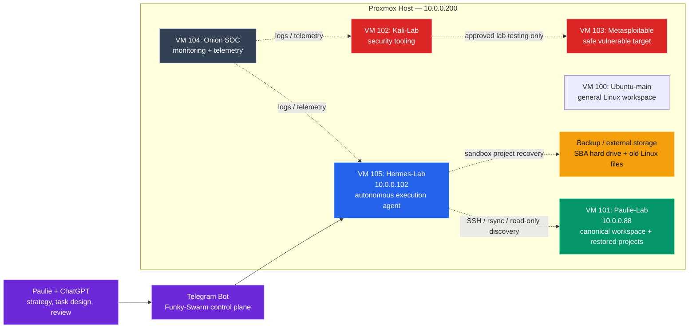

# PROJECT Funky Swarm — VM Architecture

## Role Summary

| Component | Role |
|---|---|
| **Paulie + ChatGPT** | Strategy, task decomposition, governance, review |
| **Telegram Bot** | Human-in-the-loop control plane for Hermes |
| **Hermes-Lab VM 105** | Autonomous execution agent, sandbox runner, memory, reports |
| **Paulie-Lab VM 101** | Canonical workspace and restored project files |
| **Ubuntu-main VM 100** | General Linux workspace / legacy helper environment |
| **Kali-Lab VM 102** | Security tooling for approved lab testing |
| **Metasploitable VM 103** | Safe vulnerable target for internal testing |
| **Onion SOC VM 104** | Monitoring, telemetry, SOC lab |
| **Backup / SBA HDD** | Historical project backups and old Linux recovery files |

## Operating Principle

Hermes-Lab performs risky or iterative execution inside sandboxes. Paulie-Lab preserves canonical project state. Proxmox remains stable infrastructure.
